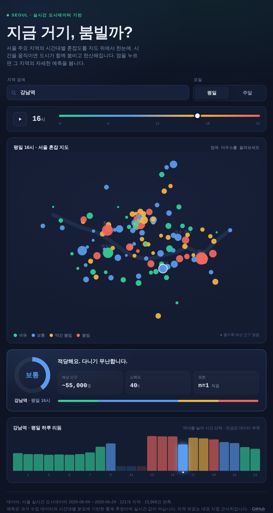

# 지금 거기, 붐빌까? — 서울 혼잡 지도 🗺️

서울 주요 지역의 **시간대별 혼잡도를 지도 위에서 한눈에** 보여주는 단일 페이지 웹앱입니다.
시간을 움직이면 도시 전체가 함께 붐비고 한산해지고, 지도의 점을 누르면 그 지역의 예상 혼잡
등급·예상 인구·신뢰도와 하루 24시간 리듬을 자세히 볼 수 있습니다.

설치도 서버도 외부 지도 API도 필요 없습니다. 좌표를 직접 투영해 그린 **자체 SVG 지도**라
`index.html` 하나로 어디서든 동작하며, **GitHub Pages에 그대로 올리면 끝**입니다.



> 🔗 라이브 데모: `https://USERNAME.github.io/seoul-congestion-predictor/`
> (아래 *배포* 안내대로 `USERNAME`을 본인 계정으로 바꾸세요.)

---

## 주요 기능

- **혼잡 지도** — 121개 지역을 한강 기준선 위에 배치하고, 선택한 요일·시각의 예측 혼잡도를
  색(여유·보통·약간 붐빔·붐빔)으로, 예상 인구를 점 크기로 표현
- **시간 스크럽 & 재생** — 슬라이더로 0~23시를 훑거나 ▶ 버튼으로 하루를 자동 재생
- **지역 상세** — 점을 누르면 혼잡 등급·예상 인구·신뢰도·표본 수와 하루 혼잡 리듬 표시
- **평일·주말 전환**, 121개 지역 검색
- 완전 반응형(모바일 대응), 키보드 접근성, 다크 테마, 의존성 0

## 작동 원리

딥러닝이 아닌 **패턴 기반 통계 예측기**입니다. 데이터가 약 3주치로 크지 않아, 과적합 위험이 큰
복잡한 모델보다 과거 분포를 집계하는 방식이 더 안정적이고 해석 가능합니다.

1. 수집 로그(CSV)를 `(지역 × 요일유형 × 시간대)`로 묶습니다.
2. 각 칸마다 4개 혼잡 등급의 **확률 분포**, **평균 추정 인구**, **표본 수**를 계산합니다.
3. **라플라스 평활(Laplace smoothing)** 을 적용해 표본이 적은 칸이 과하게 확신하지 않도록
   신뢰도를 보정합니다. (예: 표본 1개짜리 칸은 신뢰도 100%가 아니라 40% 정도로 낮아짐)
4. 앱은 선택 조건의 칸을 조회해 예측을 보여주고, 칸이 비면 요일 무관 전체 평균 → 인접 시간대
   순으로 자동 보정합니다.

학습 결과는 `data/model.json`으로 저장되고, 배포 편의를 위해 `index.html` 안에 인라인으로 주입됩니다.

## 프로젝트 구조

```
seoul-congestion-predictor/
├── index.html               # 앱 본체 (모델·좌표 내장, 이 파일만으로 동작)
├── data/
│   ├── seoul_population_log.csv   # 원본 수집 로그
│   ├── area_coords.json           # 121개 지역 좌표(지도용, 수정 가능)
│   └── model.json                 # 학습된 예측 모델 (스크립트가 생성)
├── scripts/
│   └── train_model.py       # CSV+좌표 → model.json 학습 + index.html 주입
├── assets/
│   └── screenshot.png
├── requirements.txt
├── LICENSE
└── README.md
```

지도 위 점의 위치가 어색하다면 `data/area_coords.json`에서 `"지역명": [위도, 경도]`를 고친 뒤
`python scripts/train_model.py`를 다시 실행하면 됩니다.

## 직접 실행하기

브라우저로 `index.html`을 그냥 열면 됩니다. 로컬 서버로 보고 싶다면:

```bash
python -m http.server 8000
# http://localhost:8000 접속
```

## 모델 다시 학습하기

데이터를 바꿨거나 로직을 수정했다면 모델을 재생성하세요. `index.html`에도 자동 주입됩니다.

```bash
pip install -r requirements.txt
python scripts/train_model.py                 # 기본: data/seoul_population_log.csv 사용
python scripts/train_model.py path/to/new.csv # 다른 CSV 사용
```

## GitHub에 올리고 배포하기

```bash
# 1) 저장소 초기화
git init
git add .
git commit -m "서울 혼잡 예측 앱"

# 2) GitHub에 빈 저장소(seoul-congestion-predictor)를 만든 뒤 연결
git remote add origin https://github.com/USERNAME/seoul-congestion-predictor.git
git branch -M main
git push -u origin main
```

그다음 **GitHub Pages**를 켜면 웹에 공개됩니다.

1. 저장소 → **Settings** → **Pages**
2. *Source* 를 **Deploy from a branch** 로
3. *Branch* 를 **main / (root)** 으로 선택 후 **Save**
4. 1~2분 뒤 `https://USERNAME.github.io/seoul-congestion-predictor/` 에서 확인

마지막으로 `index.html` 푸터와 이 README의 `USERNAME`을 본인 계정으로 바꿔주세요.

## 데이터와 한계

- 데이터: 서울 실시간 도시데이터 기반 수집 로그(2026-06-04 ~ 2026-06-24, 121개 지역, 약 16,000건).
- **혼잡도는 밀도·보행 편의 기준**이라 인구 수와 항상 비례하지 않습니다. 면적이 넓은 지역
  (예: 여의도)은 인구가 많아도 '여유'로 분류될 수 있습니다.
- **시간 공백**: 원본에 10~12시 데이터가 없어 이 구간은 인접 시간대로 추정합니다.
- **요일 단위**: 표본이 적어 평일/주말 2단위로 학습했습니다. 거시적으로는 토요일이 일요일보다
  붐비는 경향이 있으나, 시간대별로 분리하기엔 표본이 부족해 주말로 묶었습니다.
- **지도 좌표**: 각 지역의 대표 지점 근사 좌표로, 실제 데이터 수집 지점과 다를 수 있습니다.
  `data/area_coords.json`에서 자유롭게 보정할 수 있습니다.
- 예측은 **과거 패턴 기반 추정**이며 실시간 값이 아닙니다.

## 라이선스

MIT License. 자유롭게 사용·수정·재배포할 수 있습니다. ([LICENSE](LICENSE))
